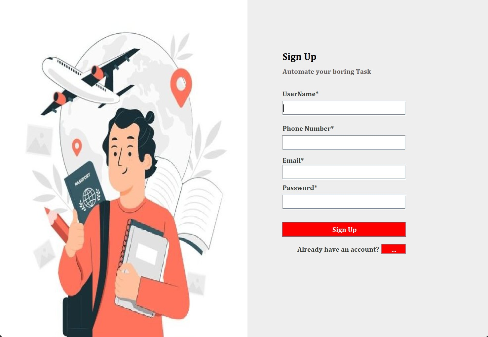
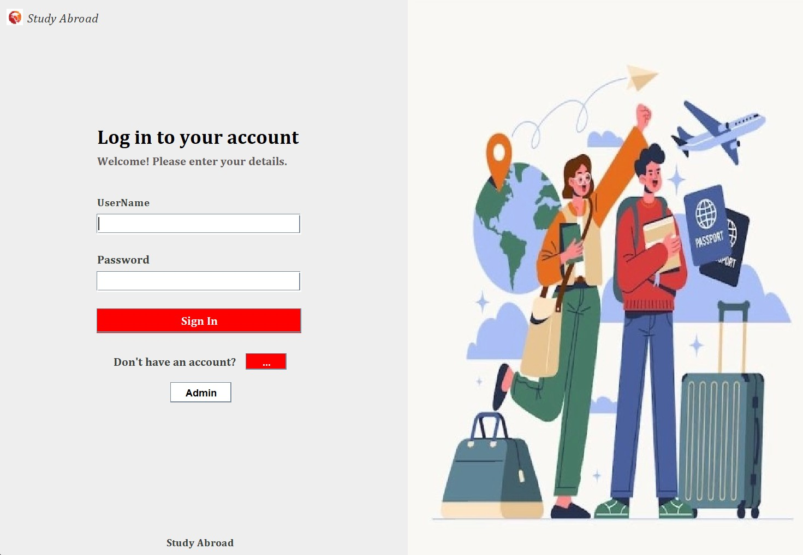
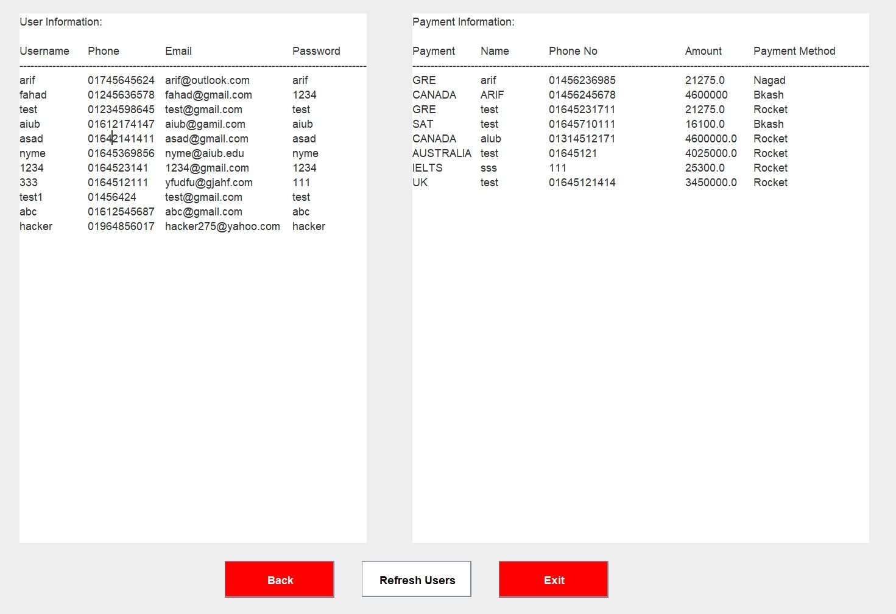
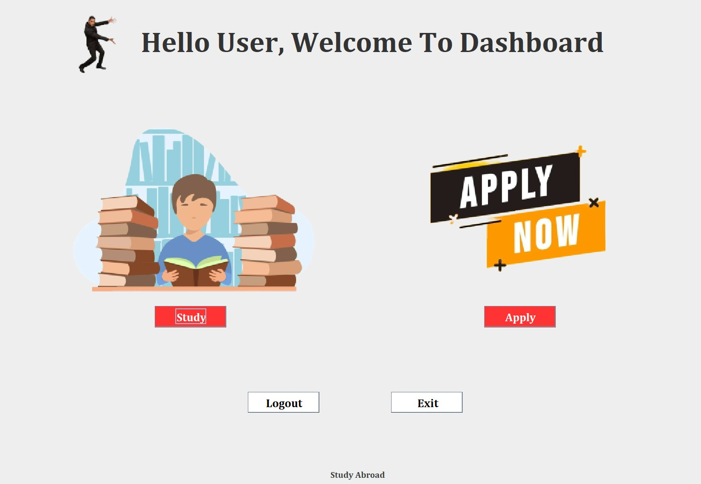
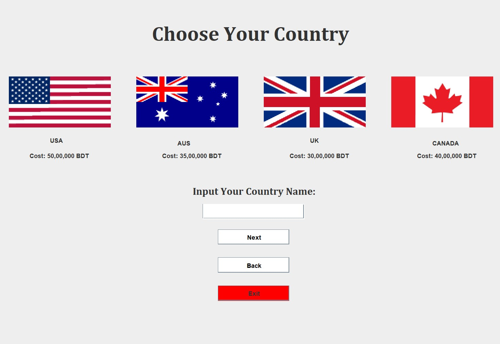
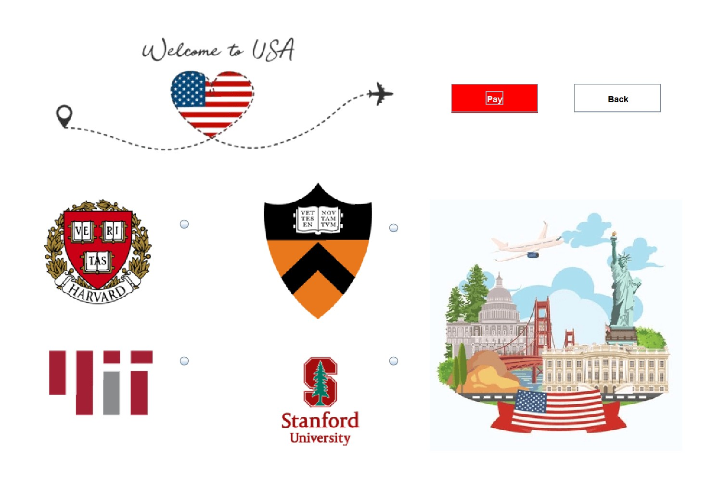
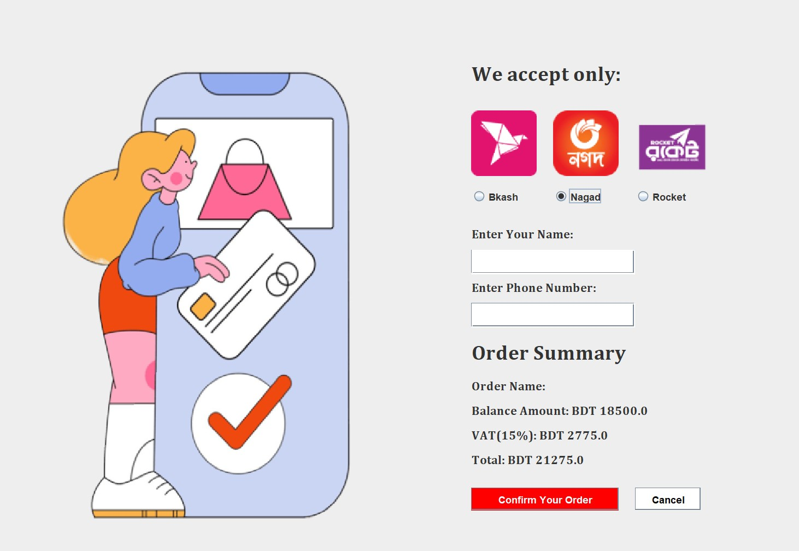

# International Education Agency Management System 🎓

The **International Education Agency Management System** is a streamlined Java GUI application designed to manage educational course marketplaces and international study applications. It provides a dual-access portal where administrators can manage user data and payments, while students can browse courses and apply for programs across five different countries.

### ✨ Key Features
- **Dual-Access Portal**: Dedicated interfaces for both users and administrators.
- **User Registration**: Simple account creation and secure login system.
- **Admin Dashboard**: Comprehensive tools for managing user records and tracking payment history.
- **Study Abroad Applications**: Direct application pathways for five major international destinations.
- **Course Marketplace**: Integrated system for browsing and purchasing educational courses.

### 🖼️ Screenshots

|  |  |  |  |
|:---:|:---:|:---:|:---:|
| 1 | 2 | 3 | 4 |
|  |  |  |  |
| 5 | 6 | 7 | 8 |

---

### 📜 Credits & License
This project was developed as part of the **OOP1 Java Project**.
